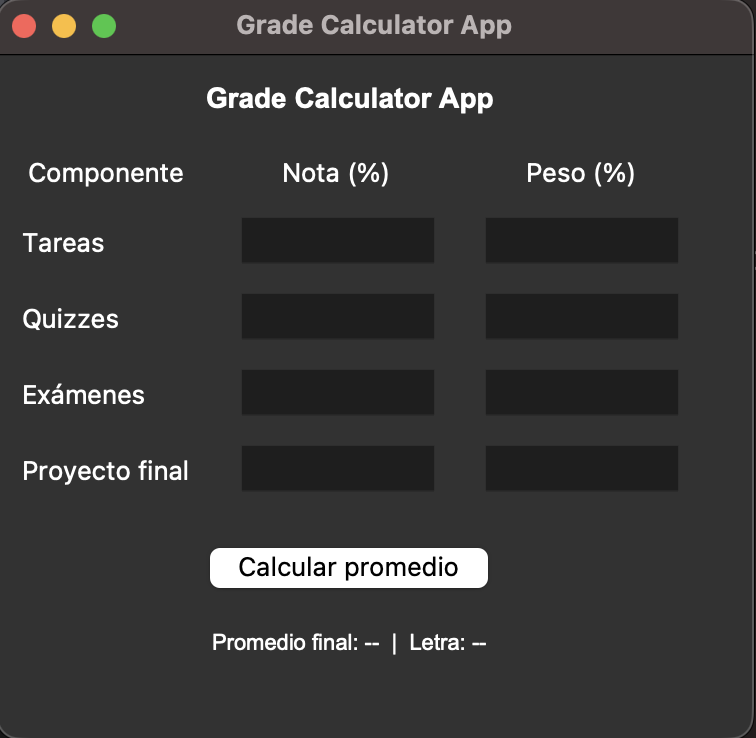

# 📘 Grade Calculator App

Aplicación de escritorio desarrollada en Python con Tkinter para calcular el promedio final de un curso usando notas y pesos de diferentes componentes (tareas, quizzes, exámenes y proyecto final).

Permite ingresar valores, validar las entradas y mostrar automáticamente la calificación final junto con la letra equivalente (A, B, C, D, F).

---

## 🖥️ Vista previa



---

## 🚀 Características

- Interfaz gráfica creada con Tkinter  
- Validación de entradas usando try/except  
- Cálculo automático de promedio ponderado  
- Conversión instantánea a calificación en letra  
- Ejecutable generado mediante PyInstaller  
- Proyecto organizado y listo para compartir o forkear  

---

## 🧠 Tecnologías utilizadas

- Python 3.13  
- Tkinter (GUI)  
- PyInstaller (generación de ejecutable)  

---

## 📂 Estructura del proyecto

```
grade_calculator_app/
│── grade_calculator_app.py     ← Script principal
│── README.md                   ← Documentación
│── grade-calc-screenshot.png   ← Imagen del proyecto
│── dist/                       ← Ejecutable generado por PyInstaller
│── build/                      ← Archivos temporales de PyInstaller
│── .gitignore                  ← Archivos ignorados
```


---

## 👩🏻‍💻 Autora

**Paola Perez**  
GitHub: https://github.com/Perezscode  
Portfolio: https://perezcode.netlify.app